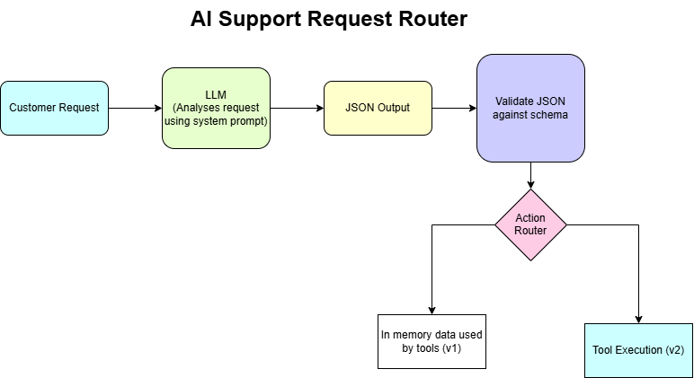

# AI Support Request Router

AI Support Request Router is a lightweight AI workflow that converts unstructured customer support requests into validated structured decisions and routes them to the appropriate business action.

## 1. Problem

Customer support requests often arrive as free-text messages and require manual classification and routing.

This project automates the flow:

```text
Customer Request
      ↓
LLM Analysis
      ↓
Structured JSON Output
      ↓
Schema Validation
      ↓
Action Router
      ↓
Business Tool
```

Example input:

```text
"I was charged twice and want a refund."
```

Example output:

```json
{
  "intent": "refund_request",
  "priority": "high",
  "amount": 84,
  "risk_level": "medium",
  "requires_human_approval": true,
  "recommended_action": "request_refund_review"
}
```

## 2. Intended Users

Designed for:

- Customer support teams
- Operations teams
- AI implementation and automation teams
- Developers building AI-powered workflows

In production, the system could sit behind chat, email, or help-desk platforms.

## 3. Tools & Frameworks

- **Python** — application and routing logic
- **FastAPI** — backend API
- **Next.js + TypeScript** — frontend
- **Ollama** — local LLM execution
- **Llama 3.1 8B** — request analysis
- **Pydantic** — schema definition and validation
- **JSON** — structured communication format
- **Python functions** — simulated business tools

Current tools:

```python
create_ticket()
request_refund_review()
lookup_order()
escalate_to_human()
```

## 4. New Concepts Used

- **Structured Outputs** — force the LLM to return predictable machine-readable data.
- **Schema Validation** — validate fields, types, and allowed values with Pydantic.
- **AI Decision Routing** — use the model's decision to select the correct application action.
- **Tool-Based Workflows** — connect AI reasoning to executable Python functions.
- **Human-in-the-Loop** — require human review for sensitive or high-risk actions.
- **Local LLM Execution** — run the workflow locally without a paid model API.
- **Frontend-to-AI Backend Flow** — send requests from Next.js to FastAPI and return structured AI results.

## 5. Architecture



### V1 Flow

```text
Next.js Frontend
       ↓
FastAPI
       ↓
Customer Request
       ↓
Ollama / Llama 3.1 8B
       ↓
Structured JSON
       ↓
Pydantic Validation
       ↓
Action Router
       ↓
Mock Business Tool
       ↓
Result returned to frontend
```

**V1:** local LLM, schema validation, Python routing, mock/in-memory data, mock business tools, and a Next.js frontend.

**Future versions:** real integrations such as Zendesk, Salesforce, Stripe, Shopify, Jira, ServiceNow, or internal REST APIs.

## 6. How to Run

### Backend

Install dependencies:

```bash
pip install ollama pydantic fastapi uvicorn
```

Pull the local model:

```bash
ollama pull llama3.1:8b
```

Start Ollama if needed:

```bash
ollama serve
```

Run the FastAPI backend:

```bash
uvicorn api:app --reload
```

Backend runs at:

```text
http://127.0.0.1:8000
```

### Frontend

From the frontend directory:

```bash
npm install
npm run dev
```

Frontend runs at:

```text
http://localhost:3000
```

### Example Request

```text
I was charged twice for my order.
Each charge was $84 and I want a refund.
```

Example result:

```text
Intent: refund_request
Priority: high
Amount: 84
Risk Level: medium
Human Approval: Required
Recommended Action: request_refund_review
```

The router then executes:

```python
request_refund_review()
```

## Project Structure

```text
ai-support-router/
├── main.py
├── api.py
├── models.py
├── tools.py
├── test_cases.py
├── aisupport.drawio.png
├── README.md
└── frontend/
```

## Current Goal

V1 demonstrates the production-style AI pattern:

**Understand → Structure → Validate → Route → Act**

The next version can add real APIs, persistent data, evaluation, observability, approval workflows, and enterprise integrations.
